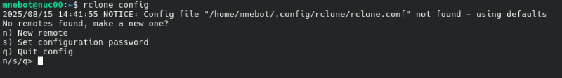
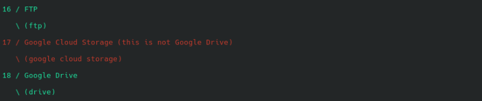
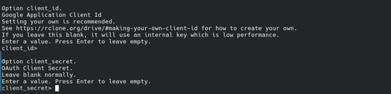
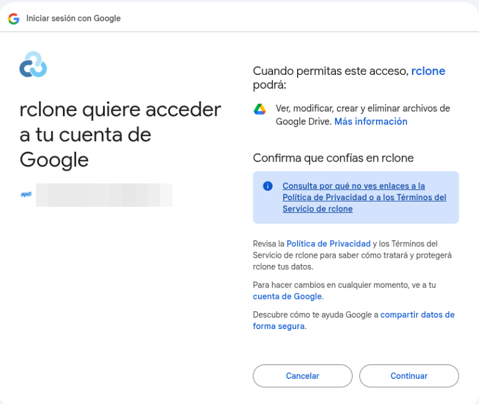
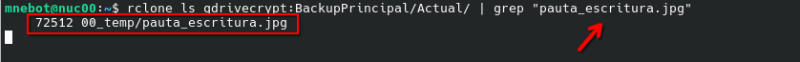
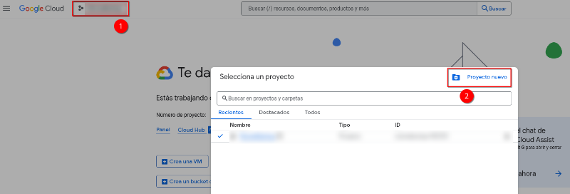
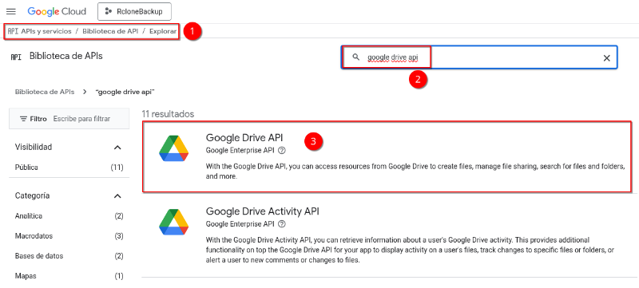

# 💾 Backup en Google Drive. Rclone+crypt

[](https://miquelnebot.eu)
[](LICENSE)  


## 👁️‍🗨️ Introducción
En el siguiente tutorial aprenderemos a realizar __copias de seguridad de nuestros archivos locales en Google Drive__ añadiendo una capa de seguridad, ya que serán mandados a destino __encriptados__.

## 💻 Requisitos
+ SO. Debian 12 o superior
+ Software. rclone v1.60.1-DEV. [RCLONE página oficial.](https://rclone.org/)
+ Cuenta de Google Drive (personal, corporativa o educativa). [Google Drive](https://drive.google.com)

## 1️⃣ Instalación y configuración de rclone en Debian

### Instalación de rclone
```bash
sudo apt update
sudo apt install rclone
```

### Configuración de rclone
```bash
rclone config
```
+ Elegiremos ``n`` para establecer una nueva conexión remota.

    

+ A continuación deberemos indicar un nombre para la nueva conexión, en mi caso será ``gdrive``.
+ Se desplegará un listado de opciones con posibles conexiones a la red como Amazon Drive, Backblaze B2, Box... En este caso elegiremos la opción de ``Google Drive`` (en la presente versión de rclone, v1.60.1-DEV, opción 18).
    
    

+ ``Option client_id``. Si lo dejamos en blanco, rclone usará una clave genérica de Google que comparten todos los usuarios de rclone. Es válido dejarlo así pero puede tener límites más bajos de velocidad cuando muchos usuarios están usando la aplicación. Para crear nuestra propia clave encontramos las instrucciones en el siguiente enlace: [rclone.org/drive](https://rclone.org/drive/#making-your-own-client-id).
+ ``Option client_secret``. Es otra parte necesaria para la identificación de rclone frente a Google. Si tanto este como el anterior los dejas vacíos, rclone utiliza valores genéricos.

    

❗ Nota: Para saber más sobre los beneficios de tener credenciales propias mediante API de Google Drive revisa la sección [💪 Crear credenciales propias de API para Google Drive](💪-Crear-credenciales-propias-de-API-para-Google-Drive) que encontrarás al final del presente tutorial.

+ ``Option scope``. Marcaremos la opción que más nos convenga, 1 en el caso que atañe a este tutorial:
    + 1 (_drive_): Acceso completo a todos los archivos de tu Google Drive. Opción recomendada a la hora de hacer copias de seguridad (lee, escribe, modifica y borra lo que sea necesario).
    + 2 (_drive.readonly_): Solo lectura. Incompatible si lo que queremos es subir copias de seguridad.
    + 3 (_drive.file_): Esta es una opción segura pero si quieres ir mezclando con cosas que ya tienes en Drive, no podrás tocarlas.
    + 4 y 5 (_drive.app_ y _drive.metadata.readonly_): Opciones muy específicas que no son de nuestro interés en el presente tutorial.
+ ``Option service_account_file``. Se usa para la identificación del usuario ante Google Drive sin intervención humana. Lo dejaremos vacío.
+ ``Edit advanced config?``. Marcaremos ``No``.
+ ``Use auto config?``. Marcaremos ``No``. De esta manera conectará para ofrecernos un enlace público que pegaremos en el navegador donde tengamos iniciada nuestra sesión de Google y proceder así con la autorización de conexión.  
❗ Nota: Como nuestro servidor no tiene entorno gráfico deberemos copiar la solicitud de autorización en la terminal de un equipo que tenga __la misma versión de rclone__ que la que tenemos instalada que nuestro servidor.
    ```bash
     rclone authorize "drive" "eyJzY45wGMI6ZkRyaXZkIn075RRaJZe2a"
    ```
    Se abrirá el navegador y procederemos a otorgar los permisos necesarios en nuestra cuenta de Google. Al finalizar el proceso tendremos el token listo para ser pegado en nuestro servidor.

    

+ ``Configure this as a Shared Drive (Team Drive)``. Al tratarse de un Drive personal y no una cuenta de trabajo con unidades compartidas, indicaremos que ``No``.
+ ``Keep this "gdrive" remote?``. Marcaremos ``Sí`` para guardar la configuración.
---
+ Repetir el proceso para crear una unidad encriptada. En mi caso recibirá el nombre de ``gdrivecrypt``.
+ Invocaremos al asistente para la creación de la nueva unidad:
    ```bash
    rclone config
    ```
+ ``New remote``: Opción ``14 (crypt)``.
+ ``Remote to encrypt/decrypt``: ``gdrive:BackupPrincipal``
+ ``Encrypt file/directory names?``: A continuación nos pedirá si queremos encriptar nombres de archivos y directorios. Le podemos indicar que sí en las dos opciones. Nos solicitará la contraseña para la encriptación de los datos, debemos **ANOTARLA Y GUARDARLA** en lugar seguro.

## ⌨️ Script para las copias de seguridad

### Script con historial de 2 versiones

```bash
#!/bin/bash

# 📂 Carpeta local a respaldar
SOURCE="/data"

# 📂 Carpeta remota cifrada
REMOTE="gdrivecrypt:BackupPrincipal"
REMOTE_ACTUAL="$REMOTE/Actual"

# 📂 Carpeta remota para el versionado
HISTDIR="$REMOTE/Historial"

# 📜 Carpeta de logs en el servidor de origen
LOGDIR="/home/mi_usuario/logs/backup_gdrive"
mkdir -p "$LOGDIR"

# 📅 Fecha para el log
DATE=$(date +"%Y-%m-%d_%H-%M-%S")

# ➕ Crear carpetas necesarias en Drive si no existen
/usr/bin/rclone mkdir "$REMOTE"
/usr/bin/rclone mkdir "$REMOTE_ACTUAL"
/usr/bin/rclone mkdir "$HISTDIR"

# 🚀 Sincronizar backup con versionado
/usr/bin/rclone sync "$SOURCE" "$REMOTE_ACTUAL" \
    --backup-dir "$HISTDIR/$DATE" \
    --progress \
    --log-file="$LOGDIR/backup_$DATE.log" \
    --log-level INFO \
    --transfers=4 \
    --checkers=8

echo "Backup con versionado completado: $DATE"

# 🧹 Limitar historial a las 2 últimas versiones
VERSIONS=$(/usr/bin/rclone lsf "$HISTDIR" | sort)
COUNT=$(echo "$VERSIONS" | wc -l)

if [ "$COUNT" -gt 2 ]; then
    TO_DELETE=$(echo "$VERSIONS" | head -n $(($COUNT - 2)))
    for v in $TO_DELETE; do
        /usr/bin/rclone purge "$HISTDIR/$v"
        echo "Eliminada versión antigua: $v"
    done
fi
```
+ Hacer ejecutable el script

```bash
chmod +x /ruta_a_mi_script/backup_gdrive.sh
```

## 🎛️ Automatizar tarea con cron
Si deseamos que el script se ejecute de manera automática siguiendo una programación específica utilizaremos cron en nuestro equipo Linux.

```bash
sudo nano /etc/crontab
```
Si, por ejemplo queremos que se ejecute cada día a las 00:01 de la madrugada escribiremos lo siguiente:

``1 0 * * * /ruta_absoluta_a_mi_script/backup_gdrive.sh``

La programación presentada significa:
+ Minuto: 1 > en el minuto 01
+ Hora: 0 > a las 00:01 de la madrugada
+ Día del mes: * > todos los días
+ Mes: * > todos los meses 
+ Día de la semana: * > todos los días de la semana

Por ejemplo, si quisiéramos que se ejecutara a las 03:00 de la madrugada solo los sábados sería:

``0 3 * * 6 /ruta_absoluta_a_mi_script/backup_gdrive.sh``

## 🔎 Listar y recuperar archivos del servidor remoto

### Listar archivos en Google Drive mediante rclone

```bash
rclone ls gdrivecrypt:BackupPrincipal/Actual/
rclone ls gdrivecrypt:BackupPrincipal/Historial/
```

### Buscar archivos o directorios concretos en servidor remoto
Aunque rclone no tiene un ``grep`` integrado de manera nativa, sí que lo podemos combinar con el de Linux para que el comando buscar devuelva una lista o archivo concreto.

```bash
rclone ls gdrivecrypt:BackupPrincipal/Actual | grep "Palabra a buscar"
```
💡 Recuerda: debes buscar en la unidad ``gdrivecrypt`` ya que buscar en ``gdrive`` lo que hace es intentar buscar el nombre del archivo que le solicitamos (por ejemplo Documento1.pdf) en una un repertorio de directorios o archivos con nombres encriptados. En definitiva, no encontraría nada.

```bash
# No
rclone ls gdrive:BackupPrincipal/Actual | grep "Documento1.pdf"
# Sí
rclone ls gdrivecrypt:BackupPrincipal/Actual | grep "Documento1.pdf"
```




### Recuperar archivos desde directorio remoto a local

```bash
rclone copy gdrivecrypt:BackupPrincipal/Actual/Documento1.pdf /home/mi_usuario/
```

## ⛑️ Custodia de archivos para la recuperación en caso de catástrofe
Llegados a este punto, es fundamental conocer el procedimiento de recuperación de nuestros datos en caso de catástrofe. De manera obligatoria deberemos disponer en un pendrive u otro dispositivo la siguiente información:

1. El __archivo de configuración de rclone__ de nuestro servidor de origen. Por norma general se encuentra en: ``~/.config/rclone/rclone.conf``. En él disponemos de la configuración de las unidades creadas en destino así como el token de acceso a nuestro Google Drive.

2. La __contraseña del crypt__ que hemos introducido en el momento de crear la segunda unidad gdrivecrypt.

## 🔄 Restaurar en un nuevo servidor
1. Instalar rclone en un nuevo servidor
2. Copiar el archivo ``rclone.conf`` en la nueva instalación. Establecer los permisos necesarios.
    ```bash
    mkdir -p ~/.config/rclone
    cp rclone.conf ~/.config/rclone/
    chmod 600 ~/.config/rclone/rclone.conf
    ```
3. Si no disponemos del archivo de configuración ``rclone.conf`` tendríamos que crear nuevamente los dos directorios remotos manualmente:
    
    + ``gdrive``
    + ``gdrivecrypt``: Este apuntando a ``gdrive:BackupPrincipal``.
    + Durante la creación de la unidad encriptada se nos solicitará la contraseña que usamos en la creación original.

4. Verificar que vemos los archivos desencriptados a través de la consola de nuestro nuevo servidor:
    ```bash
    rclone ls gdrivecrypt:BackupPrincipal/Actual
    rclone ls gdrivecrypt:BackupPrincipal/Historial
    ```
5. Para restaurar archivos:
    + 1 archivo concreto: ``rclone copy gdrivecrypt:BackupPrincipal/Actual/Documento1.pdf /home/mi_usuario/``
    + Restaurar todo el backup: ``rclone sync gdrivecrypt:BackupPrincipal/Actual /ruta/local``

## 💪 Crear credenciales propias de API para Google Drive
Si nuestra intención es pasar grandes cantidades de archivos desde un repositorio local a Google Drive, conseguiremos mejor rendimiento si obviamos las credenciales genéricas por defecto y creamos las nuestras propias. ¿Por qué?

+ Cuando __no configuramos__ ``client_id`` y ``client_secret`` propios, rclone usa credenciales públicas utilizadas por muchos usuarios.
+ Debido a eso, Google establece cuotas y limitaciones de uso.
+ Con credenciales propias tenemos nuestra propia cuota lo que se traduce en más velocidad y estabilidad en la conexión.

### Guía para la creación de credenciales propias mediante API de Google

1. Ir a [Google Cloud Console](https://console.cloud.google.com)
2. Crear un proyecto nuevo, por ejemplo de nombre _RcloneBackup_.



3. Activar la API de Google Drive en el menú ``API y servicios`` > ``Biblioteca`` > ``Google Drive API``> ``Activar``.



4. Creación de credenciales. Marcaremos ``Datos de los usuarios``.
5. Tipo de aplicación. Marcaremos ``App de escritorio``.

Llegados a este último punto Google procederá con la descarga de nuestro ``client_id`` y ``client_secret`` propios.